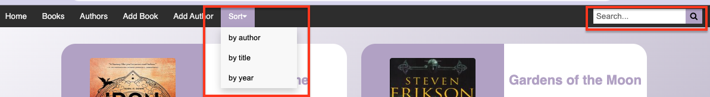
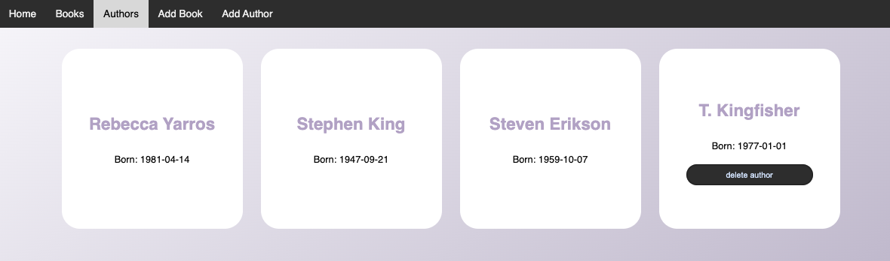
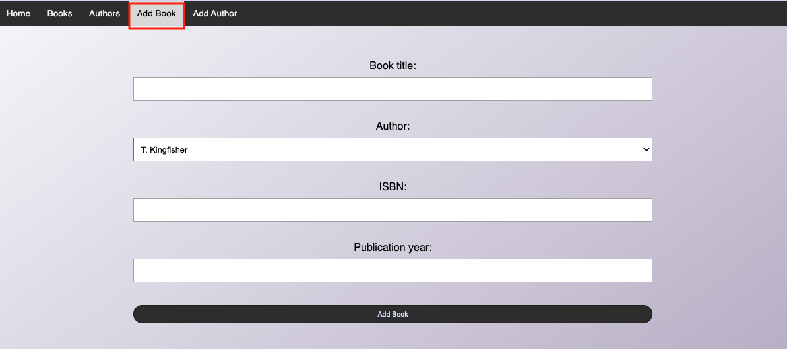

# BookAlchemy 📚

BookAlchemy is a simple web app offering users a place to store their books.

## Purpose:
Use BookAlchemy to keep track of the books you know and the authors you read. You can and delete authors and books, as many editions as you like.
Under the hood, BookAlchemy uses an OpenLibraryAPI to dynamically fetch book covers and stores all the data in an SQL database for easy and smooth user experience.

## Set up:
To set the app up, simply clone this repository and install all the dependencies specified in "requirements.txt". This project does not have user identification and thanks to using OpenLibrary API, no API_KEY is necessary.

## Usage:
Once all the dependencies are installed, simply run 
> flask run app.py 

in the terminal and enjoy your personal library.

## Features:

- Home page displays 3 most recently added books and suggests a next read
- Books page displays all the books in the DB. Additionally offers a user 3 sorting options and a search bar.

- Authors page displays all the authors in the DB.

- Books and Authors pages offer an option to delete a record from a DB. Each book can be deleted and each author who does not have any books in the books table.
- Add book/add author pages consist of input forms allowing the user to add a new record.

